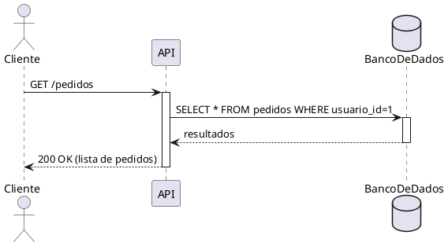

Um diagrama de sequência é um tipo de diagrama de interação que descreve como e em que ordem um conjunto de objetos (ou participantes) trocam mensagens para realizar um comportamento ou caso de uso.

Esses diagramas ajudam a documentar e comunicar o fluxo de mensagens entre componentes, identificar responsabilidades, e entender o timing e dependências entre partes do sistema.

Principais elementos
- Participantes / Lifelines: entidades que participam da interação (usuário, serviços, bancos de dados).
- Mensagens: chamadas síncronas, assíncronas, respostas e retornos de erro.
- Ativações (activation bars): período em que um participante está executando uma ação.
- Fragmentos (alt, opt, loop): estruturas para representar decisões, condições e repetições.

Quando usar
- Detalhar um caso de uso ou fluxo específico.
- Comunicar contratos entre serviços ou componentes.
- Identificar pontos de latência, bloqueios ou dependências fortes entre módulos.

Exemplo em plantuml

---

Boas práticas
- Use nomes claros para participantes e mensagens.
- Complementar com diagrama de sequência por componente quando houver muitas interações.